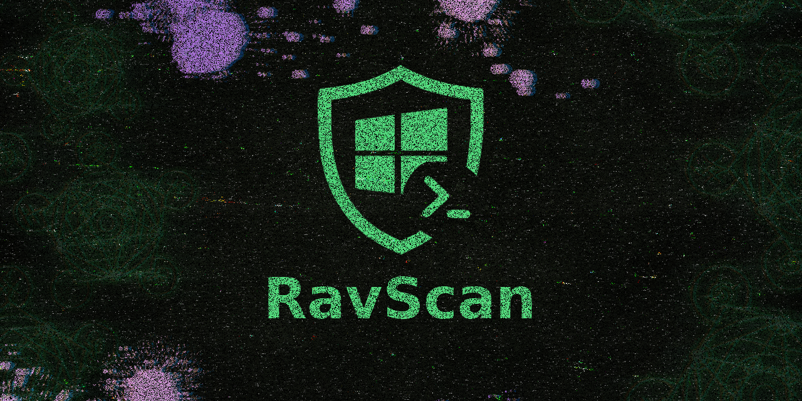

> [!WARNING]  
> Esta ferramenta é um recurso complementar que **não substitui um antivírus**, nem dispensa os serviços de especialistas da área de segurança digital.

---

# 🌐 FONTES & COMPLEMENTARES

<details>
  <summary><strong>📰 Artigos</strong></summary>

  - [Trend Micro: Self-Propagating Malware Spreading Via WhatsApp, Targets Brazilian Users](https://www.trendmicro.com/en_us/research/25/j/self-propagating-malware-spreads-via-whatsapp.html)
  - [TecMundo: Brasil é alvo de vírus que se espalha sozinho pelo WhatsApp](https://www.tecmundo.com.br/seguranca/407548-brasil-e-alvo-de-virus-que-se-espalha-sozinho-pelo-whatsapp.htm)
</details>

<details>
  <summary><strong>⚙️ Ferramentas e Guias Técnicos</strong></summary>

  - [WinTools: Monitoramento de Segurança com o Visualizador de Eventos](https://github.com/ravenastar-js/wintools/blob/all/TOOLS/docs/v_eventos.txt)
  - [SECGUIDE: Guia de Consulta para Eventos de Segurança do Windows](https://secguide.pages.dev/win-eventos/)
</details>

<details>
  <summary><strong>🎓 Aurelio "Baboo" </strong></summary>

  - [WRS: Aula 07 - Eliminação TRIPLA de malwares](https://youtu.be/nsPtwcyejrA)
  - [WRS: Aula 08 - Bloqueador de propaganda e de URL](https://youtu.be/Msd_taTz5Eg)
  - [WRS2: Aula 08 - KVRT e HouseCall](https://youtu.be/oSqcTfFcvQc)
  - [WRS2: Aula 09 - ESET Online Scanner, Emisoft Em. Kit e Malwarebytes Premium](https://youtu.be/Wnopfm8FYaU)
  - [Playlist Completa - Windows Rápido e Seguro 2.0](https://youtube.com/playlist?list=PLQfECKnJK6RxHHZ8c8Z8LaBHGfgfbXLpr)
</details>

<details>
  <summary><strong>🎓 Fábio Akita</strong></summary>

  - [Sua Segurança é uma DROGA | Gerenciadores de Senhas, 2FA, Encriptação](https://youtu.be/s7ldn31OEFc)
</details>

---

# 🚀 RAVSCAN - Scanner de Segurança para Windows

> **Ferramenta para detecção, análise e remoção de malwares com foco em ameaças brasileiras**



## 📖 Índice Rápido
1. [✨ Características Principais](#-características-principais)
2. [🖥️ Como Executar](#️-como-executar)
3. [🎮 Modo Interativo](#-modo-interativo)
4. [⌨️ Modo Comando Direto](#️-modo-comando-direto)
5. [📝 Listas Personalizáveis](#-listas-personalizáveis)
6. [🎯 Exemplos Práticos](#-exemplos-práticos)
7. [🛠️ Funcionalidades Detalhadas](#️-funcionalidades-detalhadas)
8. [⚙️ Arquitetura Técnica](#️-arquitetura-técnica)
9. [🔧 Configuração](#-configuração)
10. [📊 Saída e Relatórios](#-saída-e-relatórios)

---

## ✨ Características Principais

- ✅ **Detecção em Tempo Real** - Monitoramento ativo de processos e conexões
- ✅ **Múltiplas Camadas de Análise** - Processos, arquivos, rede e persistência
- ✅ **Interface Profissional** - Sistema de cores e visualização intuitiva
- ✅ **Sistema de Logging** - Registro completo de todas as atividades
- ✅ **Remoção Automática** - Opção de limpeza automática de ameaças
- ✅ **Listas Customizáveis** - Adaptável às ameaças específicas do ambiente
- ✅ **Baixo Impacto** - Execução eficiente sem sobrecarregar o sistema

---

## 🖥️ Como Executar

### **Pré-requisitos**
- Windows 7, 8, 10 ou 11
- Permissões de administrador (recomendado)
- Prompt de Comando ou PowerShell

### **Execução no Windows**

#### **Prompt de Comando (CMD)**
```
# Navegue até a pasta "scripts" e execute:
ravscan.cmd
```

#### **Windows PowerShell**
```
# Abra o PowerShell como Administrador dentro da pasta "scripts" e execute:
.\ravscan.cmd

# Para executar sem restrições de política:
Set-ExecutionPolicy -ExecutionPolicy RemoteSigned -Scope CurrentUser
.\ravscan.cmd
```

#### **Execução com Argumentos**
```
# Exemplo com parâmetros específicos
.\ravscan.cmd scan --remove --log --debug
```

> ⚠️ **Execução como Administrador Recomendada** - Para acesso completo ao sistema e máxima eficácia

---

## 🎮 Modo Interativo (Padrão)

### **Menu Principal**

Quando executado sem argumentos, o RAVSCAN inicia no modo interativo com interface amigável:

```
┌──────────────────────────────────────────────────────────────────────┐
│                       MENU PRINCIPAL - v1.0.0                        │
└──────────────────────────────────────────────────────────────────────┘

Selecione uma opcao:

[1] Verificacao Completa do Sistema
    • Scan completo de processos, arquivos e conexoes
    • Verifica mecanismos de persistencia
    • Relatorio detalhado

[2] Verificacao Rapida  
    • Apenas processos em execucao
    • Ideal para checagens rapidas

[3] Estatisticas e Relatorios
    • Mostra dados das listas
    • Informacoes do sistema
    • Historico de deteccoes

[4] Configuracoes
    • Alternar remocao automatica
    • Ativar/desativar logs
    • Configurar interface

[5] Sobre / Ajuda
    • Informacoes da versao
    • Instrucoes de uso

[0] Sair
```

### **Menu de Configurações**

Acessível através da opção 4 no menu principal:

```
┌──────────────────────────────────────────────────────────────────────┐
│                    CONFIGURAÇÕES DO SISTEMA                          │
└──────────────────────────────────────────────────────────────────────┘

Opcoes atuais de configuracao:

Remocao Automatica: [DESATIVADO] - Remove ameacas automaticamente
Modo Debug: [DESATIVADO] - Exibe informacoes tecnicas detalhadas
Sistema de Log: [ATIVADO] - Registra atividades em arquivo
Mostrar Tudo: [ATIVADO] - Exibe todos os resultados
Cores e Efeitos: [ATIVADO] - Interface colorida e visual

[1] Alternar Remocao Automatica
[2] Alternar Modo Debug  
[3] Alternar Sistema de Log
[4] Alternar Mostrar Tudo
[5] Alternar Cores e Efeitos
[6] Restaurar Padroes
[7] Voltar ao Menu Principal
```

---

## ⌨️ Modo Comando Direto

### **Sintaxe Completa:**
```
.\ravscan.cmd [MODO] [OPÇÕES]
```

### **Modos de Operação Disponíveis:**

| Comando | Descrição | Uso Recomendado |
|---------|-----------|-----------------|
| `scan` | Verificação completa do sistema | Análise profunda |
| `quick` | Verificação rápida (apenas processos) | Diagnóstico rápido |
| `stats` | Estatísticas e relatórios | Monitoramento |
| `help` | Ajuda detalhada | Consulta |
| `version` | Informações da versão | Verificação |
| `menu` | Menu interativo (padrão) | Uso interativo |

### **Opções Avançadas:**

| Opção | Descrição | Impacto |
|-------|-----------|---------|
| `--remove` ou `-r` | **Remove ameaças automaticamente** ⚠️ | **CRÍTICO** |
| `--debug` | Modo detalhado técnico | Desenvolvimento |
| `--silent` | Execução silenciosa | Scripting |
| `--log` | Ativa sistema de logging | Auditoria |
| `--no-log` | Desativa logging | Performance |
| `--all` | Mostra todos os resultados | Debug |
| `--minimal` | Mostra apenas ameaças | Produção |
| `--no-color` | Interface sem cores | Compatibilidade |
| `--color` | Interface colorida | Visual |

---

## 📝 Listas Personalizáveis

### **Estrutura de Arquivos de Dados**

O RAVSCAN utiliza três arquivos principais para detecção, localizados na pasta `data\`:

### **1. Processos Maliciosos (`data\processos.txt`)**
```
# Lista (um por linha)
# Processos e executáveis maliciosos - Campanha SORVEPOTEL
# Baseado em pesquisa Trend Micro
# Arquivos executáveis e scripts de payload
# Formato: nome_do_processo.exe
# Comentários começam com #

malware.exe
virus.bat  
HealthApp-0d97b7.bat
suspicious_process.exe
trojan.exe
backdoor.exe
```

### **2. Padrões de Arquivos (`data\arquivos.txt`)**
```
# Lista (um por linha)
# Padrões de arquivos maliciosos - Campanha SORVEPOTEL
# Baseado em pesquisa Trend Micro
# Arquivos ZIP maliciosos
# Use * para curingas
# Suporta múltiplas extensões
# Comentários começam com #

RES-*.zip
ORCAMENTO_*.zip
COMPROVANTE_*.zip
ComprovanteSantander-*.zip
NEW-*-PED_*.zip
ComprovanteSantander-*.lnk
HealthApp-*.bat
DOC-*.lnk
HealthApp-0d97b7.bat
```

### **3. IPs e Domínios Maliciosos (`data\ips.txt`)**
```
# Lista (um por linha)
# IPs e domínios maliciosos - Campanha SORVEPOTEL
# Baseado em pesquisa Trend Micro
# Domínios entre [.] para evitar acionamento
# Comentários começam com #

109.176.30.141
165.154.254.44
23.227.203.148
77.111.101.169
sorvetenopoate[.]com
sorvetenoopote[.]com
etenopote[.]com
expahnsiveuser[.]com
sorv[.]etenopote[.]com
sorvetenopotel[.]com
cliente[.]rte[.]com[.]br
```

---

## 🎯 Exemplos Práticos

### **1. Verificação Completa com Remoção Automática**
```
.\ravscan.cmd scan --remove --log
```
**Resultado:** 
- Scan completo do sistema
- Remove ameaças automaticamente  
- Salva log detalhado
- Relatório final consolidado

### **2. Verificação Rápida para Diagnóstico**
```
.\ravscan.cmd quick --all --debug
```
**Resultado:**
- Verificação rápida de processos
- Mostra todos os resultados (limpos e infectados)
- Modo técnico detalhado
- Ideal para troubleshooting

### **3. Apenas Estatísticas e Monitoramento**
```
.\ravscan.cmd stats --minimal
```
**Resultado:**
- Dados essenciais das listas
- Contagens de itens monitorados
- Informações do sistema
- Saída limpa e objetiva

### **4. Scan Completo sem Ações Destrutivas**
```
.\ravscan.cmd scan --no-color
```
**Resultado:**
- Verificação completa
- Interface simples sem cores
- Apenas detecção (sem remoção)
- Ideal para primeira execução

### **5. Help e Informações da Versão**
```
.\ravscan.cmd help
.\ravscan.cmd version
```

---

## 🛠️ Funcionalidades Detalhadas

### **🔍 Sistema de Detecção Multi-camadas**

#### **1. Análise de Processos**
- Monitoramento em tempo real de processos ativos
- Comparação com lista de processos maliciosos
- Detecção por nome exato do executável
- Capacidade de finalização automática

#### **2. Varredura de Arquivos**
- Busca recursiva em locais críticos do sistema
- Suporte a padrões com curingas
- Varredura em múltiplos diretórios:
  - Área de trabalho e downloads
  - Diretórios temporários
  - Pastas de sistema
  - Locais de auto-inicialização

#### **3. Monitoramento de Rede**
- Análise de conexões ativas de rede
- Detecção de comunicação com IPs maliciosos
- Verificação via comando `netstat`
- Alertas de conexões suspeitas

#### **4. Verificação de Persistência**
- Análise de mecanismos de auto-inicialização
- Verificação de pastas de startup
- Detecção de ameaças residentes
- Prevenção de reinfecção

### **📊 Sistema de Relatórios**

#### **Relatório de Verificação Completa**
```
┌──────────────────────────────────────────────────────────────────────┐
│                   RELATÓRIO FINAL DE VERIFICAÇÃO                     │
└──────────────────────────────────────────────────────────────────────┘

Processos verificados: 15
Processos maliciosos: 2
Arquivos verificados: 8  
Arquivos maliciosos: 3
IPs verificados: 10
Conexões maliciosas: 1
Mecanismos de persistência: 1
```

### **🎨 Sistema de Interface Visual**

#### **Códigos de Cores e Ícones**
- 🔴 **Vermelho**: Ameaças críticas e erros
- 🟢 **Verde**: Itens seguros e sucessos
- 🟡 **Amarelo**: Alertas e avisos
- 🔵 **Azul**: Informações e estatísticas
- ⚪ **Cinza**: Debug e detalhes técnicos

#### **Indicadores Visuais**
```
🔴 [AMEAÇA] PROCESSO MALICIOSO
    Alvo: malware.exe
    Info: Em execução - PID: 1234

🟢 [LIMPO] Processo seguro: explorer.exe
    Não está em execução

🚨🚨🚨 [CRÍTICO] CONEXÃO ATIVA DETECTADA
    IP: 109.176.30.141
    ALERTA CRÍTICO
```

---

## ⚙️ Arquitetura Técnica

### **Estrutura de Diretórios**
```
📁 ravscan/                              📁  # Diretório raiz do projeto
├── 📁 scripts/                          ⚙️  # Pasta principal de execução
│   ├── 🏗️  ravscan.cmd                  🔧  # Script principal do scanner
│   └── 📁 data/                         🗃️  # Listas de detecção modularizadas
│       ├── 📄 processos.txt             👁️  # Processos maliciosos conhecidos
│       ├── 📄 arquivos.txt              📊  # Padrões de arquivos suspeitos
│       ├── 📄 caminhos.txt              📁  # Locais para verificação
│       ├── 📄 reg.txt                   🔧  # Chaves de registro suspeitas
│       ├── 📄 ips.txt                   🌐  # IPs maliciosos (APENAS IPs)
│       └── 📄 dominios.txt              🔗  # Domínios maliciosos (APENAS domínios)
├── 📁 logs/                             📒  # Sistema de logging automático
│   └── 📄 ravscan_AAAAMMDD_HHMMSS.log   ⏰  # Logs com timestamp
└── 📄 README.txt                        📖  # Documentação do projeto
```

### **Fluxo de Execução**

1. **Inicialização**
   - Configuração de ambiente
   - Criação de diretórios necessários
   - Carregamento de configurações

2. **Processamento de Argumentos**
   - Análise de parâmetros de linha de comando
   - Configuração de modos de operação
   - Definição de comportamentos

3. **Execução Principal**
   - Modo interativo ou direto
   - Carregamento das listas de detecção
   - Execução das verificações

4. **Geração de Relatórios**
   - Consolidação de resultados
   - Logging de atividades
   - Saída formatada

---

## 🔧 Configuração

### **Variáveis de Ambiente Principais**

| Variável | Descrição | Padrão |
|----------|-----------|--------|
| `AUTO_REMOVE` | Remoção automática | `0` (Desativado) |
| `DEBUG` | Modo detalhado | `0` (Desativado) |
| `LOG_ENABLED` | Sistema de logging | `1` (Ativado) |
| `SHOW_ALL` | Mostrar todos resultados | `1` (Ativado) |
| `COLOR_ENABLED` | Interface colorida | `1` (Ativado) |
| `SCAN_DEPTH` | Profundidade da varredura | `3` |

### **Locais de Varredura**

O sistema verifica automaticamente nos seguintes locais:
- `%USERPROFILE%\Desktop`
- `%USERPROFILE%\Downloads` 
- `%TEMP%`
- `%APPDATA%`
- `%PROGRAMDATA%`
- `C:\Windows\Temp`

### **Locais de Persistência Monitorados**
- `%USERPROFILE%\AppData\Roaming\Microsoft\Windows\Start Menu\Programs\Startup`
- `%APPDATA%\Microsoft\Windows\Start Menu\Programs\Startup`
- `%PROGRAMDATA%\Microsoft\Windows\Start Menu\Programs\StartUp`

---

## 📊 Saída e Relatórios

### **Sistema de Logging**

#### **Formato do Arquivo de Log**
```
[DD/MM/YYYY HH:MM:SS] RAVSCAN v1.0.0 iniciado
[DD/MM/YYYY HH:MM:SS] Modo: scan
[DD/MM/YYYY HH:MM:SS] Auto-remove: 1
[DD/MM/YYYY HH:MM:SS] PROCESSO_ENCONTRADO: malware.exe - PID: 1234
[DD/MM/YYYY HH:MM:SS] PROCESSO_FINALIZADO: malware.exe - PID: 1234
[DD/MM/YYYY HH:MM:SS] ARQUIVO_REMOVIDO: C:\malware.exe
[DD/MM/YYYY HH:MM:SS] CONEXAO_SUSPEITA: 109.176.30.141
[DD/MM/YYYY HH:MM:SS] RAVSCAN finalizado
```

#### **Estrutura do Nome do Log**
```
logs\ravscan_YYYYMMDD_HHMMSS.log
```

### **Códigos de Saída**

| Código | Significado |
|--------|-------------|
| `0` | Sucesso - Execução completada |
| `1` | Erro - Falha na execução |
| `2` | Ameaças detectadas |
| `3` | Erro de configuração |

---

## ⚠️ Melhores Práticas e Recomendações

### **1. Ordem de Execução Recomendada**
```
# Primeira execução (apenas detecção)
.\ravscan.cmd scan

# Segunda execução (com remoção, se necessário)
.\ravscan.cmd scan --remove --log

# Verificação rápida para monitoramento contínuo
.\ravscan.cmd quick --minimal
```

### **2. Manutenção das Listas**

**Atualização Regular:**
- Adicione novos processos maliciosos descobertos
- Inclua padrões de arquivos de novas ameaças
- Atualize lista de IPs e domínios maliciosos
- Revise e limpe entradas obsoletas

### **3. Configurações de Segurança**

**Para Ambiente de Produção:**
```
.\ravscan.cmd scan --remove --log --minimal
```

**Para Ambiente de Teste/Desenvolvimento:**
```
.\ravscan.cmd scan --all --debug --no-remove
```

---

## 🆘 Solução de Problemas

### **Problemas Comuns e Soluções**

#### **1. "Acesso Negado" ao Finalizar Processos**
- **Causa**: Permissões insuficientes
- **Solução**: Executar como Administrador

#### **2. Logs Não São Gerados**
- **Causa**: Diretório logs/ não existe ou sem permissão
- **Solução**: Verificar permissões da pasta

#### **3. Cores Não São Exibidas**
- **Causa**: Terminal não suporta cores ANSI
- **Solução**: Usar `--no-color` ou atualizar terminal

#### **4. Detecções Falsas Positivas**
- **Causa**: Listas muito agressivas
- **Solução**: Revisar e ajustar listas em `data\`

### **Comandos de Diagnóstico**
```
# Verificar configuração atual
.\ravscan.cmd stats

# Testar com debug ativado
.\ravscan.cmd quick --debug --all

# Verificar logs gerados
dir logs\
```

---

## 📞 Suporte e Recursos

### **Comandos de Ajuda**
```
# Ajuda completa
.\ravscan.cmd help

# Informações da versão
.\ravscan.cmd version

# Menu interativo com todas opções
.\ravscan.cmd menu
```

### **Recursos Adicionais**

- **Documentação**: Consulte este README para referência completa
- **Listas**: Personalize os arquivos em `data\` para suas necessidades
- **Logs**: Revise os arquivos em `logs\` para análise forense
- **Configuração**: Use o menu de configurações para ajustar comportamento

---

**💡 Dica Profissional:** Comece sempre com `.\ravscan.cmd menu` para explorar todas as funcionalidades de forma interativa!

---

*📅 **Versão:** 1.0.0 | **Compatível:** Windows 7, 8, 10, 11 | **Arquitetura:** x86 e x64* 

*🔒 **Desenvolvido com foco em segurança e eficiência para ambientes corporativos e domésticos***
